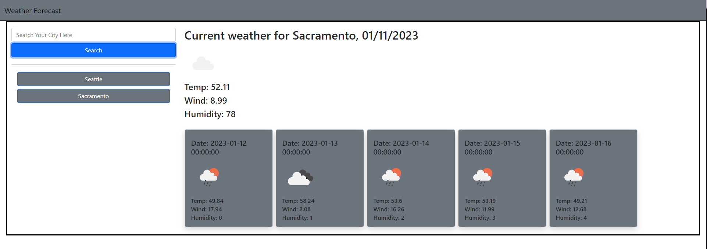

# Weather-App

## Description

The motivation for this project was to have a personal weather forecast app that can be customized however I would like. This solves the problem of not being able to change weather apps to be more custom. Currently, there are no custom features, but building this so far has taught me a lot about navigating responses from server-side API's.

## Installation

No installation required, just visit the link of the deployed page [here](https://blaubachs.github.io/weather-app/).

## Usage

To use this application, enter the city you wish to see the current weather and 5 day forecast for, and the page will populate based on the entry created.

**NOTE:** *Currently, there is not a feature that double-checks the city. This is in development.*

## Features

Current features:

+ 5 day forecast will populate based off of user search.
+ Current weather will populate based off of user search.
+ Buttons for previously searched items will populate under the search button.
    + *Clicking one of these buttons will populate data for it's corrosponding city.*
